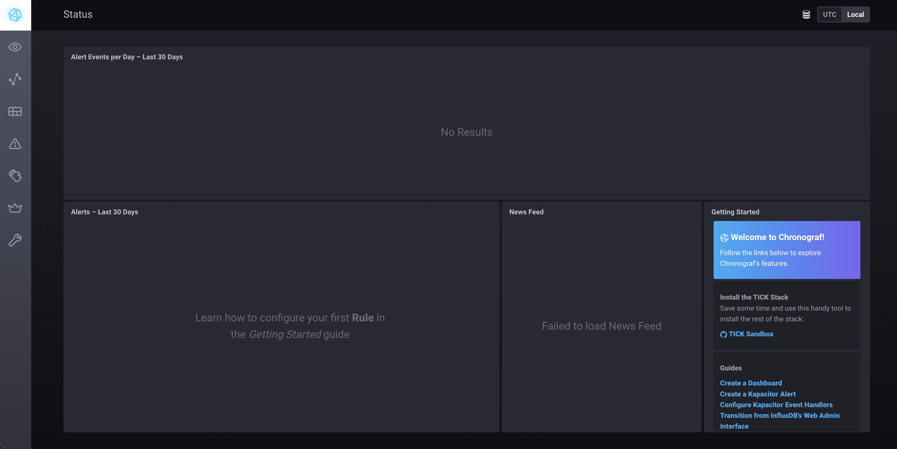
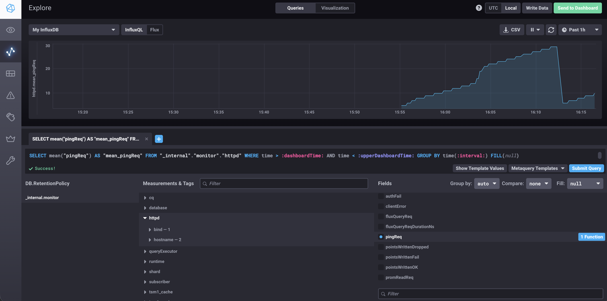

#Домашнее задание к занятию "13.Системы мониторинга". Ответы

##Обязательные занятия

#
1. Стандартные метрики по загрузке ЦПУ и Памяти, свободное дисковое пространство, учет inodes, если отчеты хранятся отдельными файлами, а также мониторинг кодов HTTP запросов

#
2. Могу предложить ввести метрику по времени обработки запросов и соотношению успешных запросов к общему их количеству. Также обговорить SLA с заказчиком и на его основе ввести SLO.

#
3. Развернуть систему мониторинга на основе бесплатныъх опенсорс решений, запустить на серверах агенты системы сониторинга. Разработчики могут перенаправить логи в агенты и в реальном времени получать информацию о работе продукта.

#
4. Не учитываются 100 и 300 коды. Верной формулой была бы (summ_1xx_requests+summ_2xx_requests+summ_3xx_requests)/summ_all_requests

#
5. 
push-модели:
Плюсы:
- упрощение репликации данных в разные системы мониторинга или их резервные копии
- более гибкая настройка отправки пакетов данных с метриками
- UDP — это менее затратный способ передачи данных, из-за чего может возрасти производительность сбора метрик
Минусы:
- данные могут теряться
- требует дополнительной настройки для того, чтобы отслеживать упавшие агенты

pull-модели:
Плюсы:
- легче контролировать подлинность данных
- можно настроить единый proxy server до всех агентов с TLS
- упрощённая отладка получения данных с агентов
Минусы:
- Больший объем пакетов и время отработки TCP

#
6. 
Pull: Nagios
Push: TICK 
Hybrid: Zabbix, VictoriaMetrics, Prometheus
#
7. 

#
8. 

